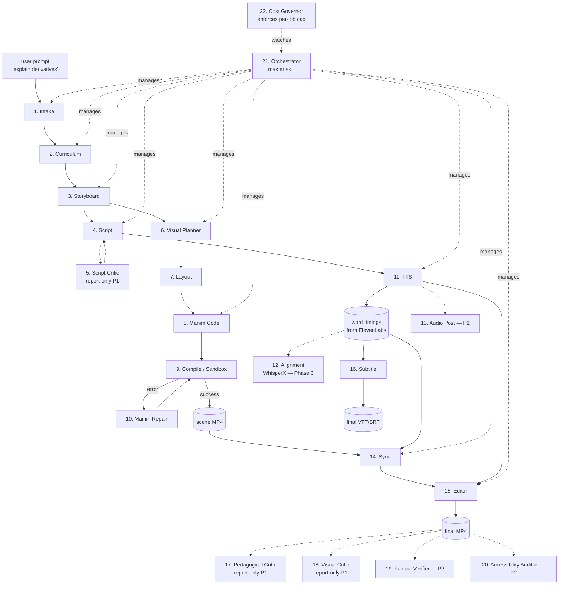

# Pedagogica — Architecture (Artifact 2)

Status: Phase 1 design. Reviewed against Artifact 1 (approved).

> **Renderer update (2026-04-21):** Every reference to "Manim" / "MCE" / "Manim Community Edition" in this document is superseded by **chalk** (this repo's own renderer). See `docs/adr/0001-chalk-replaces-manim.md` for the decision and `docs/CHALK_ROADMAP.md` for the phased primitive plan. Agent skill names (`manim-code`, `manim-primitives`, `manim-<domain>-patterns`) are renamed to the `chalk-*` equivalents. Sandbox, code-execution semantics, schema shapes, and DAG structure are unchanged.

This document is the single source of truth for how Pedagogica is organized: how code is laid out, how agents communicate, what state is persisted, how Manim executes safely, how we observe what happens, and how the architecture evolves from the Phase-1 Claude Code-native runtime toward a hosted Python service by Phase 4.

---

## 1. Overview

Pedagogica turns a learning objective ("explain the chain rule to a calc 1 student") into a narrated explainer video (MP4) via a pipeline of specialized agents. In Phase 1, the whole pipeline runs inside a single Claude Code session on the user's Mac. The user types `/pedagogica generate "…"` and a master skill orchestrates ~22 sub-agents, writing typed JSON artifacts to disk between stages, calling local Python helpers for non-LLM work (Manim render, FFmpeg concat, ElevenLabs TTS), and producing a final `.mp4` plus `.vtt` subtitles.

**Why Claude Code-native for Phase 1:** zero Anthropic-API cost (uses the user's Claude Code subscription), inherits model routing / skill loading / transcript observability for free, avoids premature Python agent-framework complexity. The architectural shape (typed messages, DAG of agents, skill registry) is preserved and portable — Phase 4 replaces the Claude Code runtime with a FastAPI + Anthropic SDK service. Skills become system prompts; JSON files become Postgres rows; `sandbox-exec` becomes Firecracker; the graph survives.

**What this doc does not cover:** individual skill contents (Artifact 3), phased milestones (Artifact 4), risks (Artifact 5), non-goals (Artifact 6).

---

## 2. Runtime model

### Phase 1: Claude Code-native

Everything that needs an LLM happens inside the Claude Code session that invoked `/pedagogica generate`. Everything that does not need an LLM (Manim render, FFmpeg stitch, HTTP call to ElevenLabs, file IO, trace logging) is a Python helper invoked via the Bash tool.

```
┌─────────────────────────────────────────────────────────────┐
│  User: /pedagogica generate "explain derivatives"           │
│                         │                                   │
│                         ▼                                   │
│  pedagogica-orchestrator (master skill)                     │
│   ├─ loads scene-spec-schema + relevant pedagogy skills     │
│   ├─ calls sub-skills in DAG order                          │
│   │    intake → curriculum → storyboard → scripts →         │
│   │    visuals → audio → sync → editor → critics            │
│   ├─ each sub-skill writes a JSON artifact to               │
│   │    ./artifacts/<job_id>/NN_<stage>.json                 │
│   └─ shells out to local Python helpers for non-LLM work    │
│         via `uv run pedagogica-tools <subcommand> …`        │
│                         │                                   │
│                         ▼                                   │
│  ./artifacts/<job_id>/final.mp4  +  .vtt  +  trace.jsonl    │
└─────────────────────────────────────────────────────────────┘
```

**Agent = skill.** Each of the 22 agents in the spec is implemented as a Claude Code skill under `pedagogica/skills/agents/<agent_name>/SKILL.md`. Skills are invoked explicitly by the orchestrator, which passes the relevant input JSON paths and awaits the output JSON path.

**Typed message = JSON file.** Every inter-agent message is a Pydantic model defined in `pedagogica/schemas/` and serialized to JSON. The orchestrator and sub-skills read and write these files; Pydantic validates on both sides (the Python helper `pedagogica-tools validate` provides this to skills via Bash).

**Parallelism via sub-agents (optional in Phase 1).** Independent work — e.g., generating Manim code for scene 3 while TTS is being fetched for scene 1 — can be parallelized by spawning Claude Code `Explore` / `general-purpose` sub-agents. Phase 1 ships serially; parallelism is a Phase 2 optimization.

### Phase 4: Python service

The skill content migrates to versioned system-prompt files. A FastAPI service with async workers replaces the orchestrator skill. Pydantic messages move from disk to Postgres rows and Redis queues. The agent DAG, message schemas, skill inventory, and artifact layout are unchanged.

### Phase 6: Open-source + self-hostable

Containerize each worker. Add Firecracker/gVisor for Manim sandbox. Provide Terraform for Postgres + Redis + S3 + GPU worker nodes. Runtime becomes pluggable — users can self-host either the Claude-Code-native runtime (cheap) or the Python-service runtime (scalable).

---

## 3. Repo layout

```
ai-blackboard/                          # repo root (project colloquially "Pedagogica")
├── CLAUDE.md                           # ≤200 lines: project orientation; line 1 = read lessons.md
├── LICENSE                             # Apache 2.0, added at Phase 6 open-source cut
├── README.md                           # end-state product description; minimal for Phase 1
├── pyproject.toml                      # uv workspace root
├── uv.lock
│
├── docs/                               # planning artifacts (this file lives here)
│   ├── ARCHITECTURE.md                 # ← you are here
│   ├── SKILLS.md                       # Artifact 3
│   ├── ROADMAP.md                      # Artifact 4
│   ├── RISKS.md                        # Artifact 5
│   ├── NON_GOALS.md                    # Artifact 6
│   └── adr/                            # architectural decision records (e.g. temporal adoption)
│
├── workflows/
│   └── lessons.md                      # append-only mistake log; read every session
│
├── pedagogica/                         # the Claude Code plugin (Phase 1 primary code)
│   ├── plugin.json                     # Claude Code plugin manifest
│   ├── commands/
│   │   └── pedagogica.md               # the /pedagogica slash command entry point
│   ├── skills/
│   │   ├── agents/                     # one dir per agent (22 total at end of Phase 1 scope)
│   │   │   ├── intake/
│   │   │   │   ├── SKILL.md
│   │   │   │   ├── examples/
│   │   │   │   └── tests/
│   │   │   ├── curriculum/
│   │   │   ├── storyboard/
│   │   │   ├── script/
│   │   │   ├── script-critic/
│   │   │   ├── visual-planner/
│   │   │   ├── layout/
│   │   │   ├── manim-code/
│   │   │   ├── manim-repair/
│   │   │   ├── tts/
│   │   │   ├── sync/
│   │   │   ├── editor/
│   │   │   ├── subtitle/
│   │   │   ├── pedagogical-critic/
│   │   │   ├── visual-critic/
│   │   │   ├── factual-verifier/
│   │   │   ├── accessibility-auditor/
│   │   │   ├── cost-governor/
│   │   │   └── orchestrator/           # the DAG driver (also a skill)
│   │   ├── knowledge/                  # knowledge skills (loaded on demand)
│   │   │   ├── pedagogy-sequencing/
│   │   │   ├── pedagogy-misconceptions/
│   │   │   ├── explanation-patterns/
│   │   │   ├── spoken-narration-style/
│   │   │   ├── manim-primitives/
│   │   │   ├── manim-calculus-patterns/
│   │   │   ├── manim-debugging/
│   │   │   ├── latex-for-video/
│   │   │   ├── scene-composition/
│   │   │   ├── audio-visual-sync/
│   │   │   ├── pedagogical-critique/
│   │   │   ├── scene-spec-schema/
│   │   │   ├── retry-strategy/
│   │   │   └── …                       # full inventory in Artifact 3
│   │   └── domains/                    # domain packs
│   │       └── domain-calculus/        # only pack in Phase 1
│   └── prompts/                        # versioned system-prompt fragments
│       └── …                           # populated when skill content stabilizes
│
├── tools/                              # Python helpers called via Bash from skills
│   ├── pyproject.toml                  # installable as `pedagogica-tools`
│   ├── src/pedagogica_tools/
│   │   ├── cli.py                      # `pedagogica-tools <subcommand>`
│   │   ├── validate.py                 # validate a JSON file against a schema
│   │   ├── manim_render.py             # sandbox + render a Manim scene
│   │   ├── elevenlabs_tts.py           # HTTP call, returns timestamps
│   │   ├── ffmpeg_mux.py               # concat scenes + mux audio
│   │   ├── subtitle_gen.py             # timestamps → VTT/SRT
│   │   ├── trace.py                    # append to trace.jsonl
│   │   ├── cost_cap.py                 # enforce per-job char/$ cap
│   │   └── job_view.py                 # `pedagogica view <job_id>`
│   └── tests/
│
├── schemas/                            # Pydantic models for inter-agent messages
│   ├── pyproject.toml                  # installable as `pedagogica-schemas`
│   ├── src/pedagogica_schemas/
│   │   ├── __init__.py
│   │   ├── intake.py
│   │   ├── curriculum.py
│   │   ├── storyboard.py
│   │   ├── script.py
│   │   ├── scene_spec.py
│   │   ├── manim_code.py
│   │   ├── audio.py
│   │   ├── timing.py
│   │   ├── trace.py
│   │   └── job.py
│   └── tests/
│
├── sandbox/
│   ├── manim.sb                        # sandbox-exec profile for Manim
│   └── README.md                       # what's denied, how to update
│
├── tests/
│   ├── regression/                     # 10 calculus topics, run before any merge
│   └── integration/                    # full-pipeline smoke tests
│
├── artifacts/                          # per-job state; gitignored
│   └── <job_id>/
│       ├── 01_intake.json
│       ├── 02_curriculum.json
│       ├── …
│       ├── scenes/
│       │   ├── scene_01/
│       │   │   ├── spec.json
│       │   │   ├── code.py             # generated Manim
│       │   │   ├── render.mp4
│       │   │   ├── tts.mp3
│       │   │   └── timing.json
│       │   └── …
│       ├── final.mp4
│       ├── final.vtt
│       └── trace.jsonl
│
└── .gitignore                          # artifacts/, .venv/, __pycache__/, etc.
```

### Conventions

- **uv workspaces** — `tools/` and `schemas/` are separate packages in a single `uv` workspace rooted at the repo. `pedagogica-schemas` is a runtime dep of `pedagogica-tools`. Skills shell out to `uv run pedagogica-tools <subcommand>`.
- **Skill layout** — every skill is a directory with `SKILL.md` (YAML frontmatter + prose), optional `examples/`, optional `tests/`. Full skill format spec lives in Artifact 3.
- **Gitignore** — `artifacts/` is never committed. Examples of successful renders can be promoted to `pedagogica/skills/*/examples/` for caching.
- **Worktree-friendly** — orchestrator skill, message schemas, and this repo layout live on `main`. Individual agent/knowledge skills are developed on feature branches / worktrees. Daily merges to `main` keep drift bounded.

---

## 4. Agent DAG

The 22 agents grouped in 6 tiers, with dataflow shown. **Solid arrows** = Phase 1 in scope; **dashed** = Phase 2+.



### Dataflow essentials

- **Intake → Curriculum → Storyboard** is strictly serial. Storyboard's output (`03_storyboard.json`) is the "single master plan" referenced by all downstream agents.
- **Script tier** runs once per scene from the storyboard. The Script Critic loop runs up to N times (Phase 1: N=0, report-only).
- **Visual tier** runs once per scene: Visual Planner → Layout → Manim Code → Compile. Compile failures trigger Manim Repair; repair is capped at 3 retries with escalating context (Phase 1: minimal error → source lines → Opus escalation).
- **Audio tier** runs per scene, in parallel with Visual tier (opportunistic — Phase 1 ships serial, Phase 2 parallelizes).
- **Sync** reconciles Manim `run_time` / `wait()` calls against word-level timings returned by ElevenLabs. This is the hardest single agent. Design details in §7.
- **Editor** stitches scene MP4s, applies transitions (Phase 1: hard cut + 0.2s crossfade), muxes audio, emits final MP4.
- **Subtitle** is a pure function of the timing data; runs anytime after TTS.
- **Critic tier** in Phase 1 reads the final MP4 + transcript and writes a report alongside (no regen loop). Phase 2 flips critics to blocking, enabling targeted scene regeneration.

---

## 5. Message schemas

Pydantic v2 models. Ten most load-bearing messages shown; full set lives in `schemas/src/pedagogica_schemas/`. All messages inherit from `BaseMessage` which carries trace metadata.

```python
# schemas/base.py
from datetime import datetime
from uuid import UUID
from pydantic import BaseModel, Field

class BaseMessage(BaseModel):
    trace_id: UUID
    parent_span_id: UUID | None = None
    span_id: UUID
    timestamp: datetime = Field(default_factory=datetime.utcnow)
    producer: str            # agent name, e.g. "storyboard"
    schema_version: str      # semver; gatekeeper for cache invalidation
```

### 5.1 `IntakeResult` — output of agent 1

```python
class IntakeResult(BaseMessage):
    topic: str                           # normalized topic, e.g. "derivative of a function"
    domain: Literal["calculus", "linalg", "prob", …]     # Phase 1: "calculus" only
    audience_level: Literal["elementary", "highschool", "undergrad", "graduate"]
    target_length_seconds: int           # 120–240 in Phase 1
    style_hints: list[str]               # free-form, e.g. ["3blue1brown", "dark-bg"]
    clarification_needed: bool           # Phase 1: always False (no clarify loop)
    clarification_question: str | None
```

### 5.2 `CurriculumPlan` — output of agent 2

```python
class LearningObjective(BaseModel):
    id: str                              # "LO1", "LO2"
    text: str                            # "understand derivative as instantaneous rate of change"
    prerequisites: list[str]             # other LO ids

class Misconception(BaseModel):
    id: str
    description: str
    preempt_strategy: str                # what the narration should do to defuse it

class CurriculumPlan(BaseMessage):
    topic: str
    objectives: list[LearningObjective]
    prerequisites: list[str]             # assumed prior knowledge
    misconceptions: list[Misconception]
    worked_examples: list[str]           # summaries, not full scripts
    sequence: list[str]                  # ordered LO ids
```

### 5.3 `Storyboard` — output of agent 3 (the master plan)

```python
class SceneBeat(BaseModel):
    scene_id: str                        # "scene_01", zero-padded
    beat_type: Literal["hook", "define", "motivate", "example", "generalize", "recap"]
    target_duration_seconds: float       # sums to ~target length
    learning_objective_id: str | None    # which LO this scene serves
    visual_intent: str                   # prose; "show f(x)=x^2 with secant line sliding to tangent"
    narration_intent: str                # prose; not the final script
    required_skills: list[str]           # which manim-*-patterns skills to load for the Manim agent

class Storyboard(BaseMessage):
    topic: str
    total_duration_seconds: float
    scenes: list[SceneBeat]
    palette: dict[str, str]              # named colors; Phase 1 = fixed preset
    voice_id: str                        # ElevenLabs voice; Phase 1 = one default
```

### 5.4 `Script` — output of agent 4 (per scene)

```python
class ScriptMarker(BaseModel):
    word_index: int                      # which word in `text` this marker anchors to
    marker_type: Literal["show", "highlight", "pause", "transition"]
    ref: str                             # scene-DSL element id, e.g. "eq.secant"

class Script(BaseMessage):
    scene_id: str
    text: str                            # spoken narration, plain text
    words: list[str]                     # tokenized view; SSOT for word indices
    markers: list[ScriptMarker]          # "show X when I say word Y" annotations
    estimated_duration_seconds: float    # rough; final is measured from TTS
```

### 5.5 `SceneSpec` — output of agent 6 (visual planner) (Scene DSL)

```python
class SceneElement(BaseModel):
    id: str                              # "eq.f", "graph.parabola"
    type: Literal["math", "text", "shape", "graph", "axes", "arrow", "label", "image"]
    content: str                         # LaTeX for math, text string, etc.
    properties: dict[str, Any] = {}      # color, stroke, font_size, etc.

class SceneAnimation(BaseModel):
    id: str
    op: Literal["write", "create", "transform", "fade_in", "fade_out", "move_to", "highlight"]
    target_ids: list[str]                # which elements this operates on
    duration_seconds: float              # preliminary; overridden by sync agent
    run_after: str | None                # ordering: the id of a prior animation, or None

class SceneSpec(BaseMessage):
    scene_id: str
    elements: list[SceneElement]
    animations: list[SceneAnimation]
    camera: dict[str, Any] = {}          # {focus_id, zoom, pan_path_ids} — empty in Phase 1
```

### 5.6 `LayoutResult` — output of agent 7

```python
class ElementPlacement(BaseModel):
    id: str
    position: tuple[float, float]        # Manim coords
    scale: float
    z_order: int
    font_size: float | None

class LayoutResult(BaseMessage):
    scene_id: str
    placements: list[ElementPlacement]
    overlap_warnings: list[str]          # empty = clean
    frame_bounds_ok: bool                # everything visible
```

### 5.7 `ManimCode` / `CompileResult` — agents 8 & 9

```python
class ManimCode(BaseMessage):
    scene_id: str
    code: str                            # full .py file content
    scene_class_name: str                # entrypoint class
    skills_loaded: list[str]             # skills referenced for provenance

class CompileResult(BaseMessage):
    scene_id: str
    success: bool
    attempt_number: int                  # 1..N
    video_path: str | None               # absolute
    frame_count: int | None
    duration_seconds: float | None
    stderr: str | None                   # captured on failure
    stdout_tail: str | None              # last ~200 lines
    error_classification: (Literal[
        "import_error", "latex_error", "geometry_error",
        "timing_error", "memory_error", "timeout", "other"
    ] | None)
```

### 5.8 `AudioClip` — output of agent 11

```python
class WordTiming(BaseModel):
    word: str
    start_seconds: float                 # start of word in audio
    end_seconds: float
    char_start: int                      # index into Script.text
    char_end: int

class AudioClip(BaseMessage):
    scene_id: str
    audio_path: str                      # mp3
    total_duration_seconds: float
    word_timings: list[WordTiming]       # from ElevenLabs natively in P1
    voice_id: str
    model_id: str                        # ElevenLabs model, e.g. "eleven_multilingual_v2"
    char_count: int                      # for cost accounting
```

### 5.9 `SyncPlan` — output of agent 14 (the hardest agent)

```python
class AnimationTiming(BaseModel):
    animation_id: str                    # from SceneSpec
    start_seconds: float                 # absolute, scene-local
    run_time_seconds: float
    wait_after_seconds: float            # pause post-animation
    anchored_word_indices: list[int]     # which spoken words this lands on

class SyncPlan(BaseMessage):
    scene_id: str
    timings: list[AnimationTiming]
    total_scene_duration: float
    audio_offset_seconds: float          # delay TTS relative to video start
    drift_seconds: float                 # predicted A/V drift; target < 0.15s
```

### 5.10 `JobState` — orchestrator state (persisted on every stage completion)

```python
class StageStatus(BaseModel):
    name: str                            # "intake", "curriculum", …
    status: Literal["pending", "in_progress", "complete", "failed", "skipped"]
    started_at: datetime | None
    completed_at: datetime | None
    artifact_path: str | None            # relative to job dir
    cost_usd: float = 0.0                # ElevenLabs only in P1
    token_counts: dict[str, int] = {}    # input/output/cache_read/cache_write

class JobState(BaseMessage):
    job_id: UUID
    created_at: datetime
    user_prompt: str
    skills_pinned: dict[str, str]        # skill_name -> version
    models_default: dict[str, str]       # agent -> model_id
    stages: list[StageStatus]
    current_stage: str | None
    terminal: bool = False
    final_artifact_paths: dict[str, str] = {}    # {"mp4": "...", "vtt": "..."}
```

### Schema versioning & validation

- Every schema carries `schema_version` (semver). Cache hits require exact-match version.
- `pedagogica-tools validate --schema <Name> <path.json>` is the one validation path. Skills call it via Bash rather than reimplementing parsing.
- Breaking schema changes bump major; any agent reading/writing an old version must be re-run on upgrade.

---

## 6. Job lifecycle (single video, happy path)

```
T+0s    user types: /pedagogica generate "explain derivatives"
T+1s    orchestrator allocates job_id (UUID), creates ./artifacts/<job_id>/
        writes job_state.json (status: intake, stages: pending)
        opens trace.jsonl

T+3s    intake agent loaded (skill) → produces 01_intake.json
        trace append: {agent: intake, input_hash, output_hash, duration, tokens}

T+10s   curriculum agent → 02_curriculum.json
T+25s   storyboard agent → 03_storyboard.json      ← master plan

for each scene (N = 6–12 in Phase 1):
    T+30s   script agent → scenes/scene_NN/script.json
    T+35s   visual-planner → scenes/scene_NN/spec.json
    T+40s   layout → scenes/scene_NN/placements.json
    T+50s   manim-code → scenes/scene_NN/code.py
    T+51s   compile (bash → pedagogica-tools manim-render)
            if fail: manim-repair → regenerate code.py, retry (≤3 attempts)
            if pass: scenes/scene_NN/render.mp4 exists
    T+110s  tts (bash → pedagogica-tools elevenlabs-tts)
            scenes/scene_NN/tts.mp3 + scenes/scene_NN/timing.json
    T+115s  sync agent → scenes/scene_NN/sync.json
    T+117s  [Phase 2] if sync.drift > 0.3s, regenerate code.py with new run_times

T+... editor (bash → pedagogica-tools ffmpeg-mux) → final.mp4
T+... subtitle (bash → pedagogica-tools subtitle-gen) → final.vtt
T+... critics (report-only) → critique.json
T+... orchestrator marks terminal=true, writes job_state.json
T+... user receives path to final.mp4
```

Wall-clock target for a 3-min video in Phase 1: **≤ 10 min**. Stretch goal: **≤ 5 min** on a warm skill cache.

---

## 7. The sync agent (called out as the hardest piece)

### Problem

Manim `run_time` values are the author's intent. ElevenLabs' actual per-word timings are measured reality. Drift accrues across a scene unless we reconcile.

### Approach (Phase 1)

1. **Visual-planner writes `run_time` estimates** based on a default rate (e.g., `write` 0.4s per symbol, `transform` 0.8s, `wait` 0.0s).
2. **Script agent tags markers** (`show eq.f at word 7`, `highlight dx at word 15`).
3. **TTS agent generates audio**; ElevenLabs returns word timings.
4. **Sync agent** produces `SyncPlan`:
   - For each animation anchored to a word, set `start_seconds` = that word's `start_seconds`.
   - Fill gaps with `wait()` calls.
   - If the resulting scene runs longer than the audio, pad TTS with silence at the end.
   - If the audio runs longer than the animation, extend the final `wait()`.
5. **Manim code agent re-emits** `code.py` with synced `run_time` and `self.wait(...)` values.
6. **Compile + render** with the synced code.

### Drift budget

- Target: < 0.15s word-to-animation drift for ≥ 90% of anchored markers.
- Measured post-hoc by `pedagogica-tools measure-drift` comparing `sync.json` to ffprobe of the final scene.
- Phase 2: if drift exceeds budget, sync agent triggers a repair loop with the visual planner.

### Phase 3 upgrade

When non-ElevenLabs TTS enters the pipeline, an Alignment agent (WhisperX) runs over the audio to extract word timings before sync. Sync's input contract is the same — it doesn't care how timings were produced.

---

## 8. Persistence model

### Phase 1 (filesystem-only)

All state lives under `./artifacts/<job_id>/`. One directory per job. No database.

- **Job-level:** `job_state.json` (authoritative status), `trace.jsonl` (append-only event log).
- **Stage-level:** `NN_<stage>.json` at job root; Pydantic-validated.
- **Scene-level:** `scenes/scene_NN/` subtree with per-scene JSON + renders + audio.
- **Skill-pinning:** `skills_loaded.json` records every skill name+version used; enables replay and regression.
- **Cache:** `./cache/llm/<hash>.json` — content-hash-addressed LLM responses. Hash input = (skill names+versions, model, full prompt, temperature). Hits skip the LLM call entirely.

**Resumability:** a job is resumable from any stage. The orchestrator reads `job_state.json`, finds the first non-complete stage, and replays from there. Cached LLM responses mean cheap dry-run.

### Phase 4 (Postgres + S3 + Redis)

- **Postgres:** `jobs`, `stages`, `traces`, `skill_pins`, `users`, `costs` — same Pydantic models, stored as rows.
- **S3 / R2:** rendered MP4s, TTS MP3s, final video, subtitles. Content-hash-addressed for dedupe.
- **Redis:** job queue, per-user rate limits, skill-registry cache.

The filesystem layout of Phase 1 is a lossless slice of the Phase 4 model — migration is a `pg_dump` after a directory walk.

### Phase 6 (self-host)

Same stores, provisioned via Terraform. Object store pluggable (S3 / R2 / GCS / MinIO).

---

## 9. Sandbox design (Manim execution)

### Threat model

The Manim code agent is a language model. Its output is code that runs in our process or a child. Worst case: malicious prompt injection writes code that exfils keys, `rm -rf`'s the repo, opens a reverse shell, or mines crypto.

### Phase 1 sandbox (macOS `sandbox-exec`)

`tools/src/pedagogica_tools/manim_render.py` invokes the rendered Python file via:

```
sandbox-exec -f sandbox/manim.sb \
  uv run --project pedagogica-render manim \
  <code.py> <SceneClass> -o <output.mp4> -qm
```

Profile `sandbox/manim.sb` denies:
- all outbound network (`(deny network-outbound)`)
- all writes outside `$ARTIFACTS_DIR/scenes/scene_NN/` and Manim's temp dir
- all reads outside read-only Python site-packages + the allowed artifact dir
- subprocess spawning except the Python interpreter itself

Enforced limits (via `resource.setrlimit` in a wrapper):
- CPU time: 300s
- Wall clock: 300s
- Memory: 4 GB
- Output file size: 500 MB
- No filesystem-level quotas; sandbox profile handles scope.

### Phase 4 sandbox (Firecracker)

Each Manim render runs in an ephemeral microVM:
- 1 vCPU, 4 GB RAM, read-only root, writable `/work` tmpfs
- Network: none
- Time: 300s hard kill
- Output pulled from `/work` to S3 after exit

### Never

No `exec()` / `eval()` / `importlib.import_module(llm_output)` in the main process. Ever. The generated `code.py` is only ever run through the sandboxed subprocess.

---

## 10. Observability

### Per-job trace (`trace.jsonl`)

One JSON event per line, appended atomically. Every LLM call, every Manim compile attempt, every TTS call, every stage transition produces an event.

```json
{"ts":"2026-04-20T21:45:33Z","trace_id":"...","span_id":"...","parent_span_id":"...",
 "event":"llm_call","agent":"manim-code","model":"claude-opus-4-7","skills":["manim-primitives@1.0.0","manim-calculus-patterns@0.3.1"],
 "input_hash":"sha256:abc…","output_hash":"sha256:def…","input_tokens":18420,"output_tokens":2103,"cache_read_tokens":17800,
 "duration_ms":4230,"cost_usd":0.0,"status":"ok"}
```

Event types: `stage_enter`, `stage_exit`, `llm_call`, `tool_call`, `manim_render`, `manim_repair`, `tts_call`, `cache_hit`, `cache_miss`, `sandbox_violation`, `cost_cap_hit`, `error`.

### Job viewer (Phase 1)

`pedagogica-tools view <job_id>` prints a timeline: agent | duration | cost | status. Dumps stdout; Unix-friendly.

### Trace UI (Phase 2)

Single-page HTML served by `pedagogica-tools view --serve <job_id>`. Waterfall of spans, per-span input/output diff viewer, skill-version strip.

### Metrics we track from day 1

- Per-job: wall-clock, ElevenLabs char count, ElevenLabs $, drift (post-sync measured), first-pass compile rate, retries per scene, LLM cache hit rate.
- Per-skill: load count, correlation with compile success / critic score.
- Per-regression-run: watchable rate (human-graded), failure modes (error classifications).

### Cost = ElevenLabs only in Phase 1

LLM calls against the Claude Code subscription are logged with token counts but `cost_usd = 0`. Gives us accurate Phase-4 cost projection without charging Phase-1 use.

---

## 11. Provider abstractions

Phase 1 hard-codes Anthropic via Claude Code + ElevenLabs via HTTP. But we design the seams so provider swaps are mechanical, not structural.

### LLM provider

Phase 1: no abstraction — skills are invoked via Claude Code's native mechanisms.

Phase 4+: `tools/src/pedagogica_tools/llm/` with:

```python
class LLMProvider(Protocol):
    async def complete(self, system: str, messages: list[Msg], model: str,
                       temperature: float = 0, seed: int | None = None,
                       cache_keys: list[str] | None = None) -> LLMResponse: ...
```

Implementations: `AnthropicProvider`, `OpenAIProvider`, `BedrockProvider`. Skills → system prompts (already versioned). `cache_keys` hooks into the content-hash LLM cache regardless of provider.

### TTS provider

Phase 1: `elevenlabs_tts.py` with direct HTTP. Returns `AudioClip` (§5.8).

Phase 3+: `tools/src/pedagogica_tools/tts/` with:

```python
class TTSProvider(Protocol):
    async def synthesize(self, text: str, voice_id: str, model: str,
                         return_word_timings: bool) -> AudioClip: ...
    @property
    def emits_word_timings(self) -> bool: ...
```

Implementations: `ElevenLabsProvider` (native timings), `OpenAIProvider` (no timings → WhisperX), `KokoroProvider`, `XTTSProvider`. Pipeline branches on `emits_word_timings`.

### Storage provider

Phase 1: local FS. Phase 4: `S3Provider`, `R2Provider`, `GCSProvider`, `MinIOProvider` behind a common `put_artifact(path, bytes)` / `get_artifact(path)` interface.

### Compute (render) provider

Phase 1: `subprocess` with `sandbox-exec`. Phase 4: `ModalProvider`, `RunpodProvider`, `FlyGPUProvider`, `LocalFirecrackerProvider`. Provider returns a rendered MP4 path given a code file.

### Why designed now but not wired

We will change providers before Phase 1 ends (e.g., ElevenLabs outage). Having the seam already drawn in the schemas (`AudioClip` doesn't know which TTS produced it) makes the swap 100 lines, not 1000.

---

## 12. Error handling & retry strategy

Codified in skill `knowledge/retry-strategy/SKILL.md` (Artifact 3 content). Summary of the policy the orchestrator enforces:

| Failure | Retry | Strategy |
|---|---|---|
| Manim compile error | ≤ 3 | 1: minimal error → Sonnet. 2: error + 40 source lines → Sonnet. 3: full file + error catalog → Opus. |
| Sync drift > budget | 0 (Phase 1) | Log only. Phase 2: re-plan visuals with adjusted run_times. |
| TTS HTTP error (5xx) | 3 | Exponential backoff 2/4/8s. |
| TTS rate limit | until reset | Sleep until `X-RateLimit-Reset`; cost_cap check on resume. |
| Sandbox violation | 0 | Hard fail. Log, alert, abort job. |
| Cost cap hit | 0 | Hard fail. Log, persist partial state, exit. |
| Schema validation fail | 1 | Re-prompt agent with validation error; second failure = hard fail. |
| LLM call timeout | 2 | Same prompt, longer timeout, then fail. |

Hard-fail doesn't mean lose work — `job_state.json` is always consistent, and resumption from the next clean stage is a single command.

---

## 13. Design decisions we're deliberately deferring

- **Multi-tenant auth / API keys / rate limits** — Phase 4.
- **Per-user cost ledgers / billing** — Phase 4.
- **Skill marketplace / third-party packs** — Phase 6.
- **Postgres schema migrations** — emerge when we adopt Postgres in Phase 4.
- **Kubernetes / autoscaling render workers** — Phase 5 when concurrency demands it.
- **Temporal / durable workflow engine** — adoption requires an ADR under `docs/adr/`, triggered when job resumption across restarts becomes painful.
- **Deterministic LLM seeds / strict replay** — Phase 3. Phase 1 logs everything and hash-caches outputs; full determinism has diminishing returns for a single-user dev loop.

---

## 14. How to change this document

1. Propose the change in a branch with an edit to this file.
2. If the change touches §4 (DAG) or §5 (schemas), add an ADR under `docs/adr/`.
3. Run the Phase 1 regression suite once it exists.
4. Merge.

Changes to the skills themselves live in Artifact 3's authoring process, not here.
